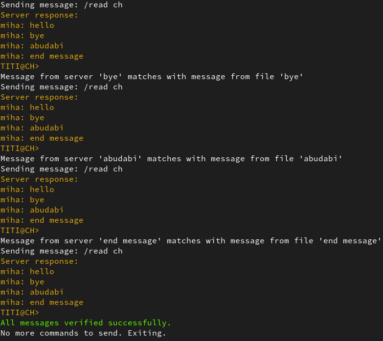

# Клиент-серверное приложение для обмена сообщениями 

Данное приложение представляет собой программу для обмена текстовыми и аудио сообщениями между клиентами. Приложение имеет две ключевые программы: server и client. 

**На сервере**: хранятся все данные подключенных пользователей, создаются и удаляются каналы.

**На клиенте**: осуществляется регистрация и авторизация клиентов, есть возможность подключения к каналам сервера для передачи сообщений другим клиентам и получения сообщений от них.

Приложение поддерживает подключение нескольких пользователей к клиенту.

## Запуск программы

```
path/messaging_app$ make
path/messaging_app/program$ ./server <port>
path/messaging_app/program$ ./client <ip-server:port>
```

## Помощь в использовании

```
path/messaging_app/program$ ./server -h
path/messaging_app/program$ ./client -h
```

Когда клиент уже подключился к серверу можно ввести команду `/help` для вывода более подробной инструкции по использованию

## Примеры работы сервера и клиента

### Подключение сервера


### Подключение и регистрация клиента


### Создание канала на сервере


### Подключение клиента к каналу, отправка сообщений и общение с другими пользователями


### Включение и отключение отображения времени


### Запуск с помощью /connect


### Удаление канала на сервере и отправка оповещений всем пользователям, подключенным к указанному каналу
#### server: 

#### client: 


### Авторизация клиента


### Отправка аудиосообщния в канал


### Прослушивание аудиосообщения из канала и сохранение аудиофайла в формате .wav


### Отправка файла в канал


### Смена ника


## Тесты

```
path/messaging_app$ make
path/messaging_app/program$ ./server <port>
path/messaging_app/tests$ ./send_script -f <file> -t <time delay>
path/messaging_app/tests$ ./listen_script -f <file> -t <time delay>
```

### send_script:


### listen_script:



